# MySketchpad
## 开发环境
该程序是在Windows10系统上，基于Qt 5.11.2构建，最低的Qt版本要求为5.6，三维模型显示部分使用OpenGL 3.2，编程语言包括cpp和qml，build system为qmake，编译器版本是MinGW 32bit。请使用QtCreator对源码进行编译或直接执行MySketchpad.exe(在平台下编译生成)

## UI介绍
程序的整体UI界面如下，这是一个参照Win10自带的画画程序设计的界面，在程序上方是一个工具栏，其中对程序的各种功能进行了分类，最左边是一些对于图像的操作，从左到右依次为清除画板，旋转（编辑状态可用），三维模型现实，打开图像以及保存图像。右边是工具栏，包括一些常规的工具，从左到右依次为选择工具（选定图形进行二次编辑），铅笔（自由画画），橡皮擦，填充，线段裁剪。再往右边则是对图形的绘制部分，可选的图形主要有5种，分别是直线、圆、椭圆、多边形、曲线。再往右就是对画笔的属性进行一些设置，包括画笔的粗细，以及边界颜色，以及填充色的设定（这里的填充色不同与填充工具，这里是绘制图元的自带属性）。每个按钮都自带一些动画，包括点击动画，鼠标悬停动画，以及选中动画等等，对用户来说是比较友好的。工具栏下方是画板，在画板上我们可以进行自由画画以及二维图元的绘制等操作

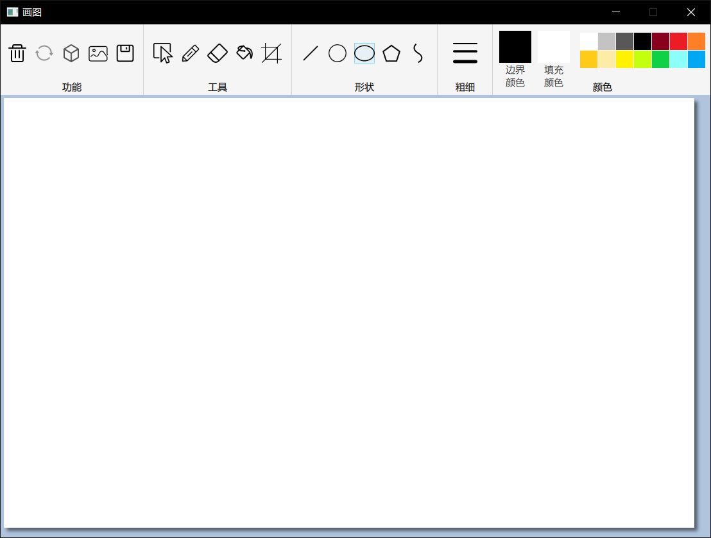

## 操作说明
### 图元的绘制
包括直线，圆，椭圆、多边形以及曲线，在工具条的形状栏中选择点击相应的图标即可进行图元的绘制，直线、圆和椭圆的绘制需要按住鼠标左键并拖动，多边形的绘制稍有不同，每个按住-拖动-释放鼠标的循环会从上一条边的终点开始绘制多边形的下一条边，而闭合多边形只需要使最后一条边的终点靠近多边形的起点（即第一次点击鼠标的位置）即可，曲线的绘制和多边形类似，但要完成曲线的绘制需要点击鼠标右键，在绘制开始前、绘制结束(使用选择工具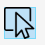)进入编辑状态时，可设置二维图元的边界颜色、边界粗细和填充颜色，当两个大色块边界为浅蓝色时表示当前选中了该色块，此时可以通过右边的小色块改变大色块的颜色，也可通过打开取色对话框来改变大色块的颜色。要选中一个大色块可以点击大色块（这将会打开对话框）或者大色块下方的文字（边界颜色或填充颜色）。如下所示

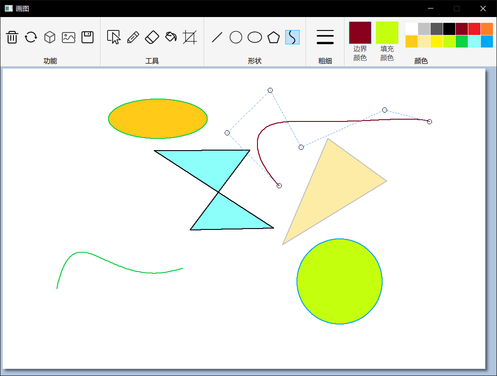

### 图元的编辑模式
当图元绘制结束后，会自动进入图元的编辑模式。除此之外，还能通过使用选择工具来进入图元的编辑模式，具体做法是在靠近图元的位置点击即可，每个图元的选择位置不同，圆是外接正方形之内，椭圆是外接矩形，多边形是靠近各边的位置，线段是靠近线段的位置，曲线是靠近起点和终点的位置。此时在图元的各个控制点上会有圆形的标志提示（见上图）。只有选中某个图元并进入其编辑模式后才能对图元进行诸如平移、旋转等操作，而所谓控制点就是能完全决定图元的一些点，比如直线是它的两个端点，多边形的控制点是其各个顶点，椭圆的控制点为外接矩形的四个顶点，圆的控制点为外接正方形的4个顶点，曲线的控制点就是其控制点。当在靠近控制点的位置按住鼠标并拖动，能将相应的控制点拖动，图元也会进行相应的形变，下图显示了我重新选择椭圆并对其进行编辑的结果。要退出编辑模式可以在编辑区域之外点击鼠标，切换工具或形状也能通过绘制新的图元退出编辑模式。

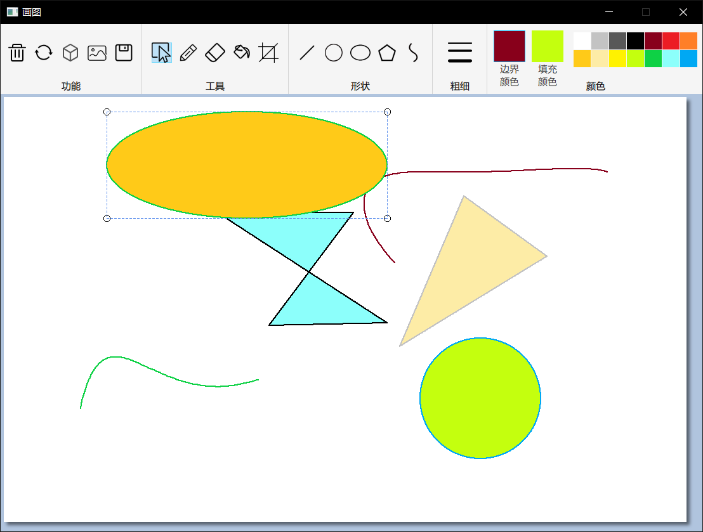

### 图元的平移
在编辑模式下，能拖动图元来实现图元的平移，对于直线和多边形来说，需要在靠近某条边的位置按住并拖动鼠标，对于椭圆和圆形则只要在矩形框内按住并拖动鼠标即可，对于曲线则需要在靠近起点或终点的位置。可以看到，我将上图中的椭圆进行了平移

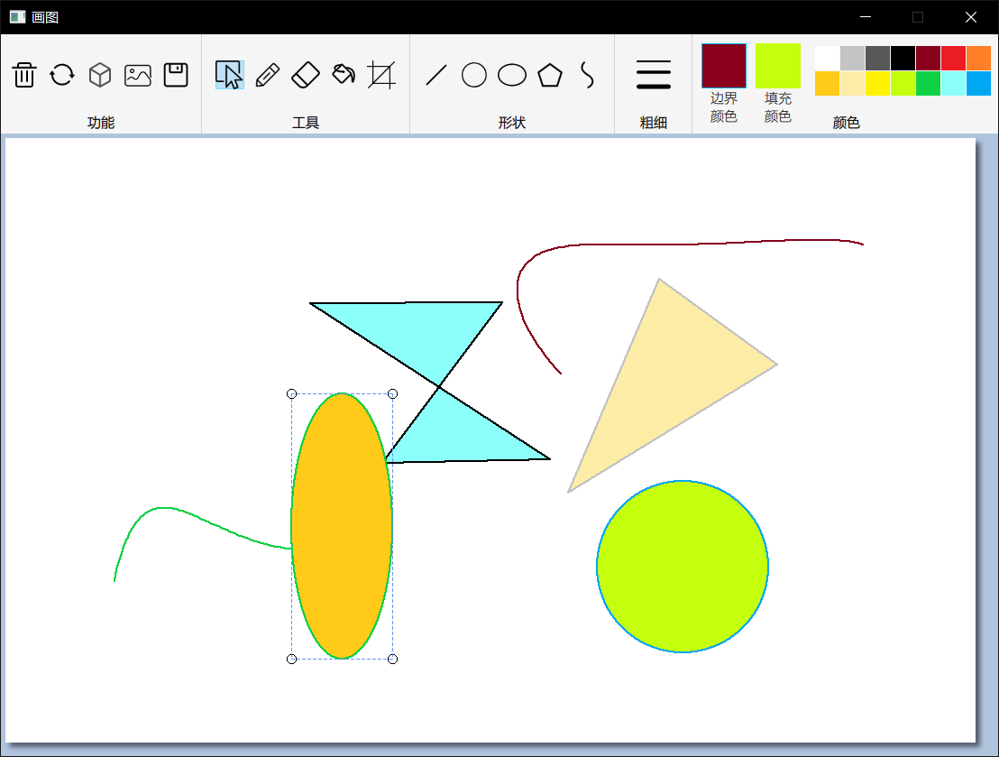

### 图元的旋转
在编辑模式下，可以点击图像栏的旋转图标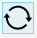（未在编辑模式下该图标将是灰色的不可选状态），然后会弹出一个选择选择角度的对话框，拖动滑动条可以选择旋转角度，此时处于编辑状态的图元会顺时针进行相应角度的旋转，旋转的参考点是图形的几何中心，在旋转之后，仍能对图元进行平移、编辑，如图所示

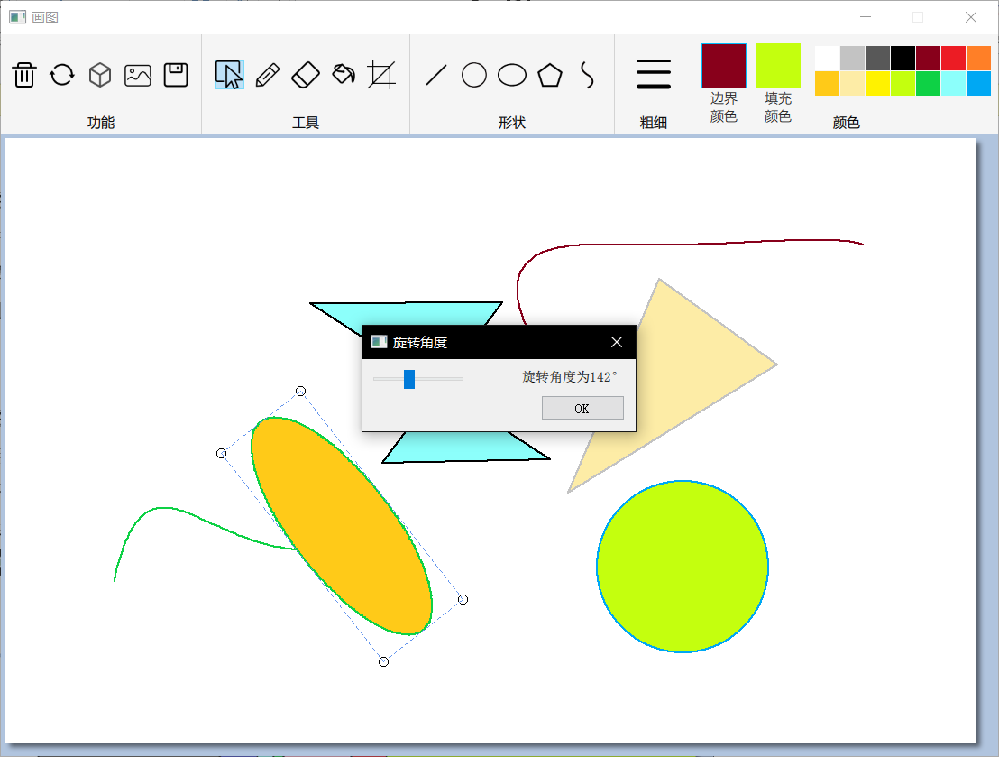

### 图元的缩放
在编辑模式下，可以通过滚动鼠标滚轮进行图元的等比例缩放

### 图元填充
不同于图元自带的填充属性，点击工具栏中的填充图标后再点击想要填充的位置，会使用颜色栏中的填充颜色对填充区域进行填充，需要注意的是，当填充工具的填充针对图像的，因此画板并不会保存其信息。

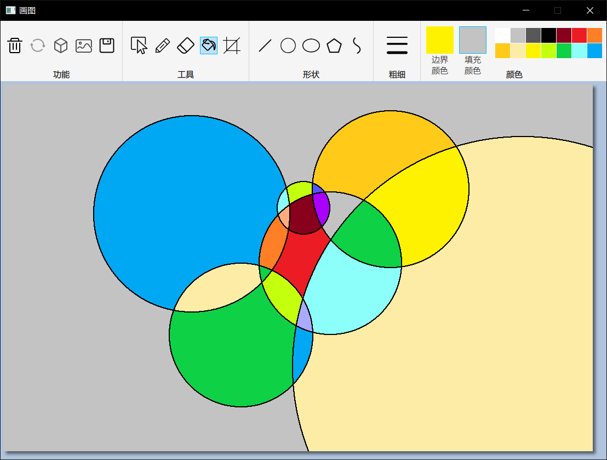

### 线段裁剪
可使用线段裁剪工具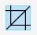进行直线的裁剪，首先绘制出一个虚线的矩形裁剪区域，该矩形裁剪区域同样可以进行编辑（除了旋转），当确定裁剪之后，可以单击裁剪区域外的空白处，或者切换工具/形状以退出编辑模式，退出编辑模式时会自动进行裁剪，裁剪后的线段仍可以通过选择工具进行选择以再次进入编辑模式

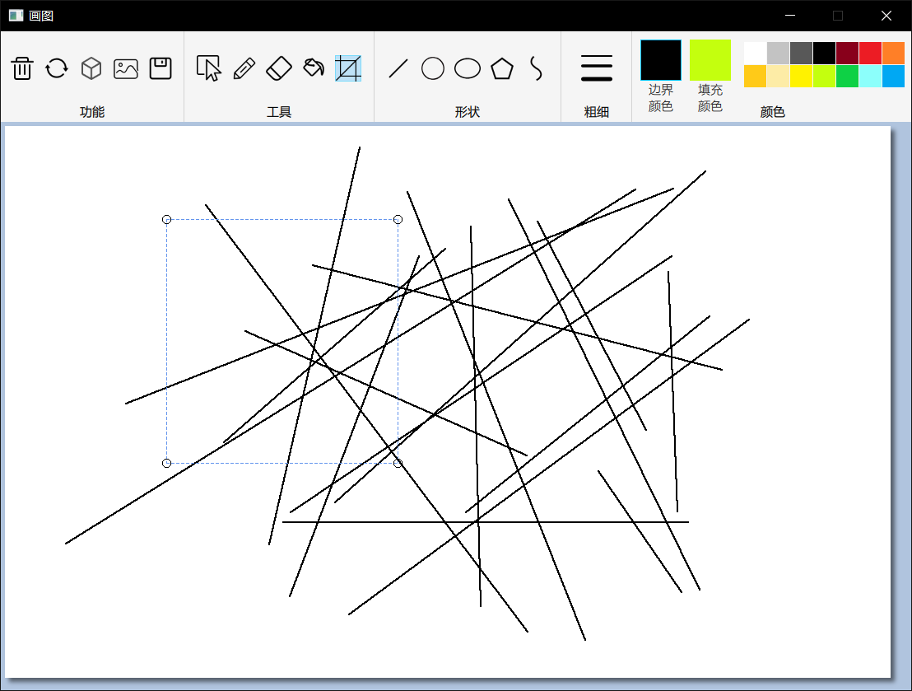

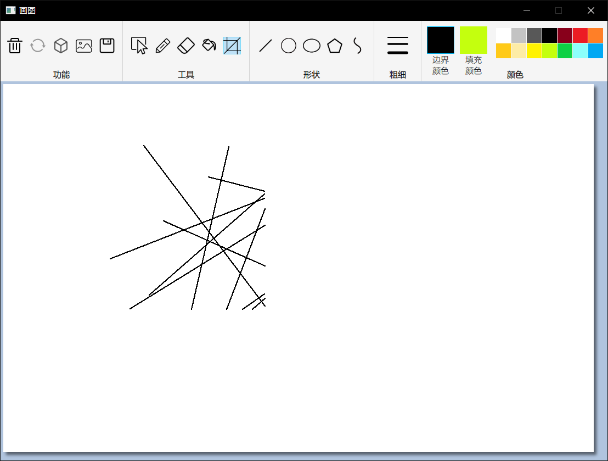